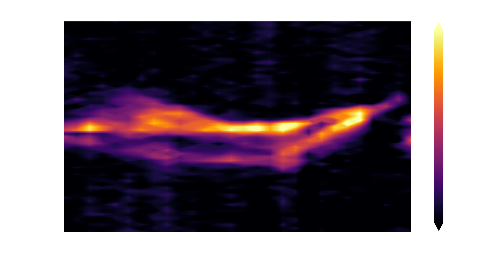
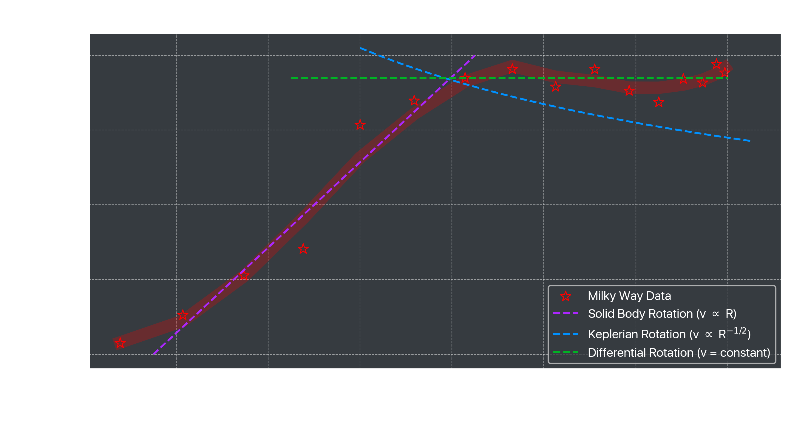

# Galactic Rotation Analysis

A rotation curve shows the orbital rotation speed of an object at various radii from its center of orbit. The planets in our solar system obey a rotation curve defined by the proportionality $v\propto R^{-1/2}$, and it was originally expected that this would also apply to our galaxy's rate of rotation. 

Using a heterodyne radio reciever called the AirSpy, measurements have been collected of radio signals around 1420 MHz originating from Hydrogen in the disk of the galaxy. With this data, it is possible to calculate the speed of rotation of the Milky Way. Through analysis, this will reveal that the rotation of the galaxy increases linearly ($v \propto R$) up to a radius of about 5 kpc, then remains **constant** at a velocity around 185 km/s. It does not follow the same proportionality that the solar system does. To account for this difference in behaviour, the galaxy must be far more massive than we can measure, which is strong evidence of the existence of dark matter within the galactic halo. 

##

The notebook `Galactic Rotation Analysis.ipynb` goes through the analysis process on the data included in the repository, relying on functions from the Python files `plot_functions.py` and `data_functions.py`.

### A Heatmap of Radial Velocities

For each longitude data was taken from, a brighter area corresponds to a higher ratio of Hydrogen emissions along the galactic plane when compared to signal not from within the galactic plane. The amount of doppler shift on the 21-cm Hydrogen line can be translated to a radial velocity for each arm in the line-of-sight, where each peak in signal strength corresponds to a different arm of the galaxy. 

### The Rotation Curve

A plot of orbital velocities of various rings of matter orbitting the galactic core. The relationship seems to increase until about 5 kpc, where it flattens off. Overlaying this with the three rotation models, we see that the Milky Way fits to the **solid body rotation** best, up until the 5 kpc mark, where it then best fits a **differential rotation** model. It does not match the relationship modelled by the Keplerian rotation curve, like was originally suspected.
